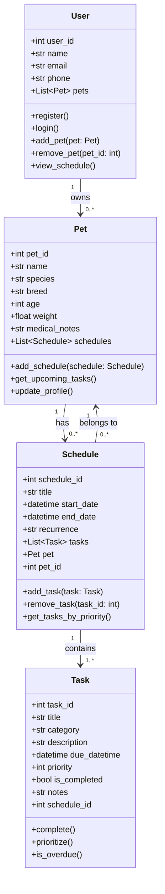

# PawPal+ (Module 2 Project)

You are building **PawPal+**, a Streamlit app that helps a pet owner plan care tasks for their pet.

## Scenario

A busy pet owner needs help staying consistent with pet care. They want an assistant that can:

- Track pet care tasks (walks, feeding, meds, enrichment, grooming, etc.)
- Consider constraints (time available, priority, owner preferences)
- Produce a daily plan and explain why it chose that plan

Your job is to design the system first (UML), then implement the logic in Python, then connect it to the Streamlit UI.

## What you will build

Your final app should:

- Let a user enter basic owner + pet info
- Let a user add/edit tasks (duration + priority at minimum)
- Generate a daily schedule/plan based on constraints and priorities
- Display the plan clearly (and ideally explain the reasoning)
- Include tests for the most important scheduling behaviors

## Getting started

### Setup

```bash
python -m venv .venv
source .venv/bin/activate  # Windows: .venv\Scripts\activate
pip install -r requirements.txt
```

### Suggested workflow

1. Read the scenario carefully and identify requirements and edge cases.
2. Draft a UML diagram (classes, attributes, methods, relationships).
3. Convert UML into Python class stubs (no logic yet).
4. Implement scheduling logic in small increments.
5. Add tests to verify key behaviors.
6. Connect your logic to the Streamlit UI in `app.py`.
7. Refine UML so it matches what you actually built.

## Smarter Scheduling

The `Schedule` class in `pawpal_system.py` extends the core daily planner with three features:

### Sort by time
`Schedule.sort_by_time()` returns all pending tasks ordered by their `"HH:MM"` due time using a `sorted()` lambda key. Pass `include_completed=True` to include finished tasks in the result.

```python
schedule.sort_by_time()                      # pending only
schedule.sort_by_time(include_completed=True) # all tasks
```

### Filter tasks
`Schedule.filter_tasks()` narrows the task list by completion status, pet name, or both. Both parameters are optional; omitting them returns every task sorted by due time.

```python
schedule.filter_tasks(completed=False)              # pending only
schedule.filter_tasks(pet_name="Kitty")             # one pet, any status
schedule.filter_tasks(completed=True, pet_name="Doggo")  # completed + pet
```

### Conflict detection
`Schedule.detect_conflicts()` finds every pair of pending tasks whose execution windows overlap — within the same pet or across different pets. It returns plain warning strings and never raises an exception.

```python
warnings = schedule.detect_conflicts()
for w in warnings:
    print(w)
# CONFLICT: 'Flea Medication' (Kitty, 12:00 PM–12:05 PM) overlaps with
#           'Midday Brush' (Kitty, 12:03 PM–12:13 PM)
```

The algorithm sorts tasks by start time first so the inner comparison loop can break as soon as a candidate starts after the current task ends — conflict-free schedules pay only the sort cost.

### Auto-scheduling recurring tasks
`Schedule.complete_task()` marks a task done and, for `"daily"` and `"weekly"` tasks, automatically creates a fresh pending instance for the next occurrence using `timedelta`. The completed task is kept as a historical record.

| Frequency | Next due |
|-----------|----------|
| `daily`   | `due_datetime + 1 day` |
| `weekly`  | `due_datetime + 7 days` |
| `once` / `monthly` | no new instance created |

---

## Testing PawPal+

Run the full test suite from the project root:

```bash
python -m pytest
```

28 tests across 19 test cases verify the three most critical scheduling behaviors:

| Area | What is tested |
|------|---------------|
| **Sorting** | `sort_by_time()` returns tasks in ascending chronological order regardless of insertion order; `filter_tasks()` results are sorted by full `due_datetime` |
| **Recurring tasks** | Completing a `daily` task creates a new pending instance due exactly 24 hours later; completing a `weekly` task advances by 7 days; completing a `once` task creates no new instance |
| **Conflict detection** | Overlapping task windows are flagged for same-pet exact overlap, same-pet partial overlap, and cross-pet overlap; adjacent (non-overlapping) tasks are never reported as conflicts; completed tasks are excluded |

### Reliability: ★★★★☆

The core scheduling logic is well-covered — sorting, recurrence, and conflict detection all pass cleanly with no edge-case failures. One star is held back because `sort_by_time` sorts by `"HH:MM"` string rather than full datetime (tasks on different calendar dates at the same clock time sort identically), and `monthly` recurrence intentionally uses a 30-day approximation instead of a calendar-aware month. Neither affects the current feature set, but both are worth revisiting before the system handles multi-day or long-horizon planning.

---


